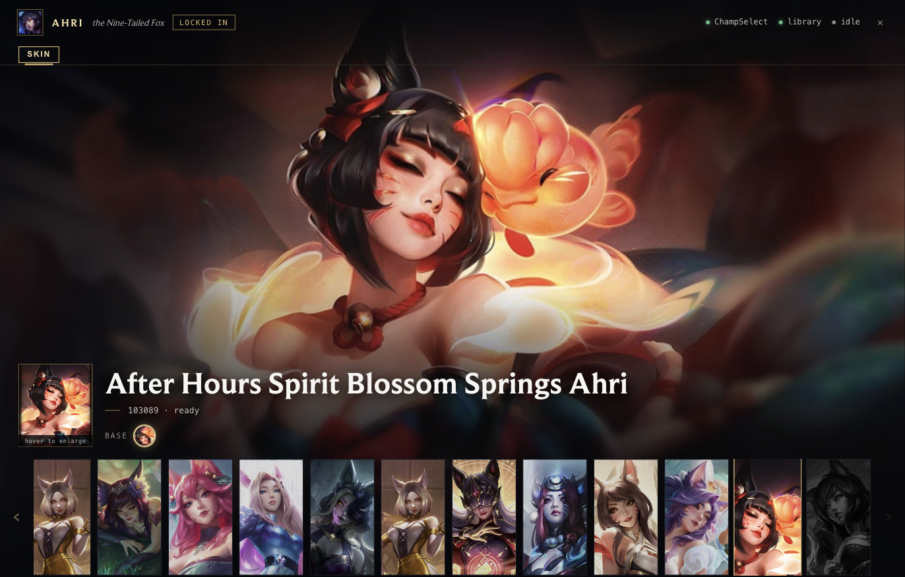
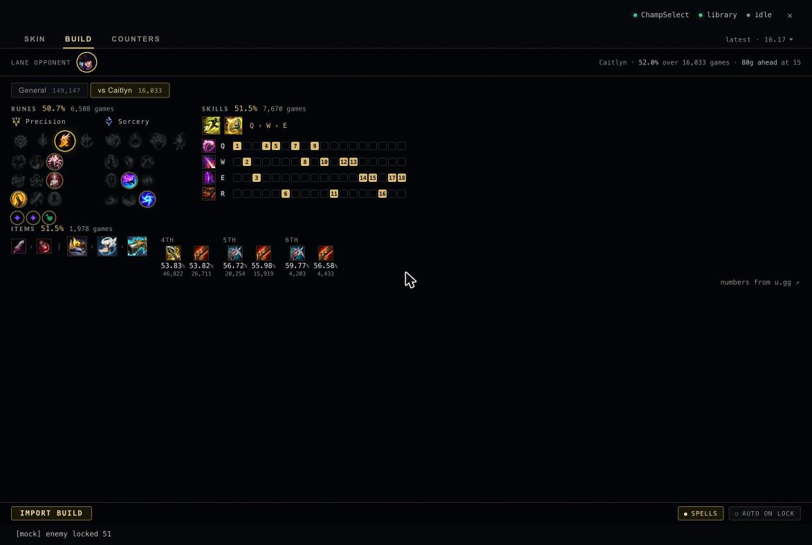
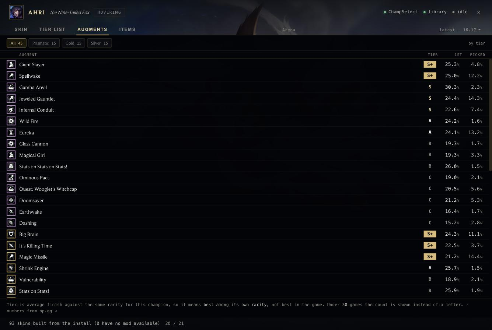

<p align="center">
  
</p>

<h1 align="center">tibbers</h1>

<p align="center">
  A League of Legends skin picker for macOS.
</p>

<p align="center">
  
  
  
</p>

<p align="center">
  <a href="https://github.com/JustTrott/tibbers/releases/latest/download/Tibbers.dmg">
    
  </a>
</p>

<p align="center">
  
</p>

<p align="center">
  <a href="https://github.com/JustTrott/tibbers/releases/latest/download/Tibbers.dmg">
    
  </a>
  <br>
  <sub>Apple Silicon · macOS 26 · then right-click → Open the first time</sub>
</p>

Hover a champion in champ select and tibbers shows you that champion's skins,
right there in a native window. Pick one and it's on your game the moment it
starts. While you're deciding, it also pulls up the champion's build and
counters, so you don't have to tab out to a stats site.

One thing worth knowing: everything you see comes from either the League client
or a public stats site. tibbers doesn't invent any of it — it just puts the
skins, builds and counters in one place while you're deciding.

## What it does

- Skins show up the instant you hover a champion, before you lock in, and start
  building quietly in the background so they're ready if you take the pick.
- It remembers the skin you like on each champion and the chroma on each skin,
  and puts them back when you lock in.
- It reads the champion's runes, items, skill order and matchups from
  [u.gg](https://u.gg), and Arena augments, items and a tier list from
  [op.gg](https://op.gg). One click imports the build straight into the client.
- An optional one-time setup lets it apply skins without asking for your
  password every game.
- Close the window and it drops into the menu bar, still watching champ select.
  A small picker raises itself when you lock a champion and closes when the
  lobby ends.

<p align="center">
  
</p>

<p align="center">
  <em>The build page — runes, skill order and items, with a link back to u.gg.</em>
</p>

<p align="center">
  
</p>

<p align="center">
  <em>Arena augments, ranked by average placement, from op.gg.</em>
</p>

## Requirements

- **macOS on Apple Silicon.** Verified on macOS 26.
- **League of Legends**, started however you normally start it.

That's it — the app bundles its own Python. (Building from source additionally
needs Python 3.)

## Install

Click **[Download for macOS](https://github.com/JustTrott/tibbers/releases/latest/download/Tibbers.dmg)**
(the button up top does the same thing), open the disk image, and drag
**Tibbers** onto the Applications folder beside it — just like any other Mac app.

The first time you open it, macOS may say it's from an unidentified developer.
Right-click the app, choose **Open**, and confirm. You only do this once.

<details>
<summary><b>Or build it from source</b></summary>

Needs Python 3 on Apple Silicon.

```bash
git clone https://github.com/JustTrott/tibbers.git
cd tibbers
scripts/setup.sh              # venv, deps, mod-tools, then build + install
```

`scripts/setup.sh --no-install` stops at `dist/Tibbers.app` instead of writing
to `/Applications`. To run straight from the checkout without building a bundle:

```bash
.venv/bin/python main.py            # native app window
.venv/bin/python main.py --browser  # a browser tab instead
```
</details>

## Using it

Start League the way you always do, then:

1. **Hover a champion.** The picker fills with its skins right away. Ones that
   are ready light up; ones with no mod available stay dimmed.
2. **Click a skin** to queue it. This arms tibbers to hook the game the moment
   it launches.
3. **Approve the prompt** once (or set up passwordless mode below to skip it).
   It shows up during champ select, and it prints the exact command it's about
   to run first.
4. **Start the game.** The skin goes on by itself. The game is never frozen or
   suspended along the way.

The tabs at the top switch between the skin, build and counters views, and you
can move around with the arrow and number keys.

### Skip the password prompt

```bash
.venv/bin/python main.py --install-helper     # one prompt, once
.venv/bin/python main.py --uninstall-helper    # undo it
```

This sets up a small helper so applying a skin stops asking for your password.
It's built to be as narrow as possible — it can only ever run the patcher, only
on your own files, and it checks itself before every run. If you want the
details, they're in
[ARCHITECTURE.md](ARCHITECTURE.md#skipping-the-password-prompt).

## How it works

When you pick a skin, tibbers builds a tiny replacement game archive that points
the base skin's asset references at the skin you chose — files that already ship
with your install, so no skin art is ever downloaded. It then starts a small
patcher (from [cslol](https://github.com/LeagueToolkit/cslol-manager)'s
`mod-tools`) that waits for the game to launch and quietly redirects its archive
reads into that overlay.

The longer version — the two-stage overlay, why the game is never frozen, how a
skin mod is built out of your own install, the passwordless helper's design, and
why the Windows approach can't work on macOS — is in
**[ARCHITECTURE.md](ARCHITECTURE.md)**.

## Credits

tibbers is mostly glue. The hard parts are other people's work:

- **[cslol-manager](https://github.com/LeagueToolkit/cslol-manager)** and the
  [League Toolkit](https://github.com/LeagueToolkit) — the `mod-tools` overlay
  builder and patcher tibbers is built around, and the WAD-format groundwork.
- **[u.gg](https://u.gg)** — the build, rune and counter statistics.
- **[op.gg](https://op.gg)** — the Arena augment, item and tier-list statistics.
- **Riot Games** — the League client, whose local API supplies every champion,
  skin, item, rune and icon in the app.

And a nod to **[Rose](https://github.com/Alban1911/Rose)**, the skin changer on
Windows that inspired this one. tibbers takes a different route to fit macOS,
but the idea started there.

Every build and counters page links back to the u.gg or op.gg page its numbers
came from.

## Is it bannable?

Short version: it's tolerated, and in practice accounts don't get banned for it.
Custom skins are client-side only — no one else sees them, and they change
nothing about how the game plays, so they give no competitive advantage. Riot
treats purely cosmetic mods like this as use-at-your-own-risk rather than
something they action, and Rose, the equivalent tool on Windows, injects the
same way without getting people banned.

The usual caveats: don't expect Riot support if something breaks, and a few
regions (Korea, Turkey, Russia) enforce more strictly than NA or EU, so know
that going in if you play there.

tibbers is unofficial and is not endorsed by, affiliated with, or sponsored by
Riot Games.

## License

tibbers is free software, released under the
[GNU General Public License v3.0](LICENSE).

Copyright © 2026 Temirlan Amanzhanov.
